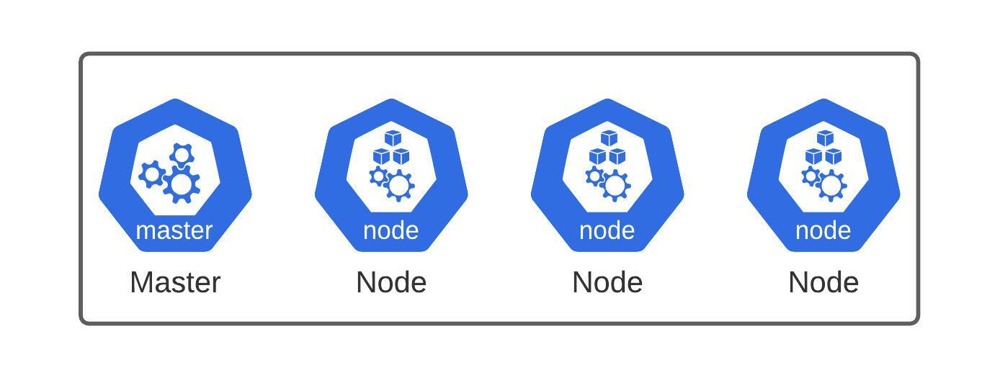
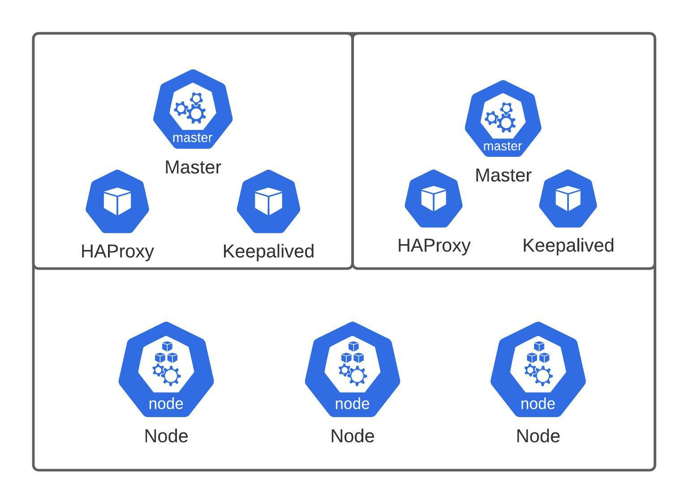
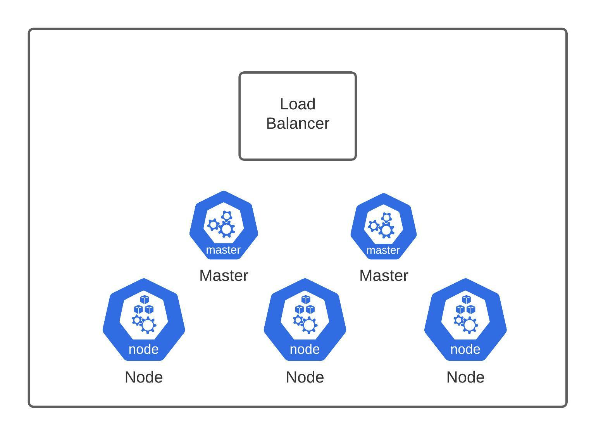
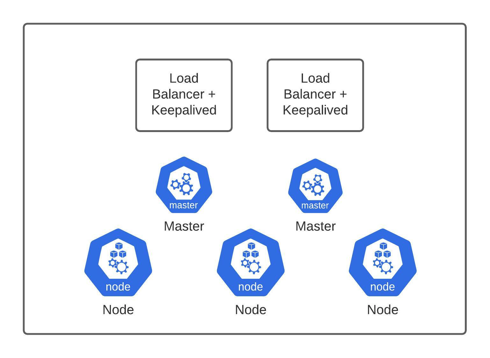
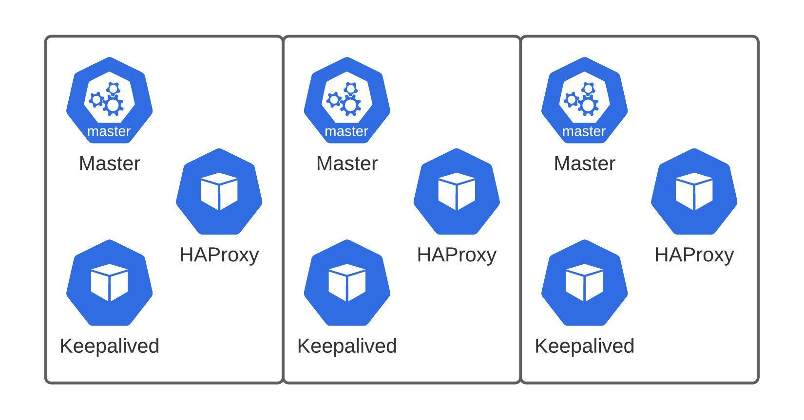

<h1>Vagrant Kubernetes Cluster</h1>
<h2>Index</h2>
<ol>
    <li><a href=#description>Description</a></li>
    <li><a href=#requirements>Requirements</a></li>
    <li><a href=#procedures>Procedures</a></li>
    <li><a href=#clusters>Types of clusters</a></li>
    <li><a href=#makefile>Makefile</a></li>
</ol>
<h2 id="description">1. Description</h2>

With this scripts you can run a local cluster of virtual machines accesible by any device in the same network than the host. According to how you fill the variables in the <a href=#makefile>Makefile</a> you can get different <a href=#types-of-clusters>types of clusters</a>.

For these scripts to work there are several <a href=#requirements>requirements</a> you will need.

<h2 id="requirements">2. Requirements</h2>
<ul>
    <li><a href="https://www.virtualbox.org/">Virtualbox</a></li>
    <li><a href="https://www.vagrantup.com/">Vagrant</a></li>
</ul>
<h2 id="procedures">3. Procedures</h2>

In order the scripts to work you need to set <b>BRIDGE_INTERFACE</b> and <b>NODE_NETWORK_BASE</b> correctly in the <a href=#makefile>Makefile</a>.

<ul>
    <li><b>make install</b>: to create some files and the virtual machines.</li>
    <li><b>make run</b>: to start up the virtual machines.</li>
    <li><b>make halt</b>: to shutdown the virtual machines.</li>
    <li><b>make delete</b>: to delete the needed files for provisioning and the virtual machines.</li>
</ul>
<h2 id="clusters">4. Types of clusters</h2>
According to the variables in the <a href=#makefile>Makefile</a> you can deploy:
<ul>
    <li>
        
Classic: 1 Master, N Nodes

        
    </li>
    <li>
        
High Availability: M Masters, N Nodes

        
    </li>
    <li>
        
Higher Availability: 1 Load Balancer, M Masters, N Nodes

        
    </li>
    <li>
        
Highest Availability: L Load Balancers, M Master, N Nodes

        
    </li>
    <li>
        
Whynot: M Masters

        
    </li>
</ul>
<h2 id="makefile">5. Makefile</h2>

The Makefile is ready to be used as the only point of configuration so it is the only file where you should change values. The values and their meaning are the following:

<ul>

</ul>